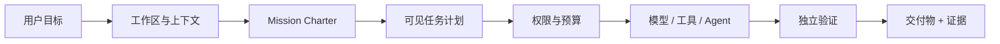
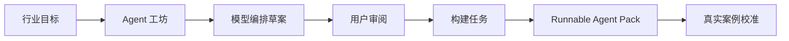
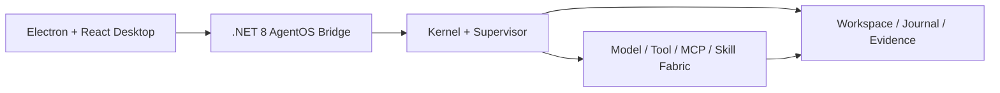

<p align="center">
  
</p>

<p align="center">
  <strong>把目标变成可验证的成果，而不只是生成一段回答。</strong>
</p>

<p align="center">
  本地优先 · 证据优先 · 用户控制 · 可插拔行业 Agent
</p>

<p align="center">
  <a href="https://github.com/binzi1989/Nova/releases/latest"><strong>下载最新版</strong></a>
  ·
  <a href="#快速开始">快速开始</a>
  ·
  <a href="AGENT-PACK-OPERATING-GUIDE.md">使用行业 Agent</a>
  ·
  <a href="AGENT-PACK-SDK.md">创建 Agent Pack</a>
</p>

<p align="center">
  <a href="https://github.com/binzi1989/Nova/actions/workflows/ci.yml"></a>
  <a href="https://github.com/binzi1989/Nova/releases"></a>
  
  
  
  
  
</p>

> [!IMPORTANT]
> 当前公开基线为 `1.0.3`，本仓库正在推进 `1.1.0-preview.15`。安装包尚未签名，自动更新默认关闭；公开下载以 [GitHub Releases](https://github.com/binzi1989/Nova/releases) 为准。NOVA 已具备完整产品骨架，但仍处于真实任务与跨平台验证阶段，不把本地测试通过等同于 GA。

## NOVA 是什么

NOVA 是一款面向 PC 的桌面 AgentOS：它把用户给出的目标转化为可见计划，在明确的工作区、权限与预算边界内调用模型、工具和子 Agent，最终用真实文件、验证结果与证据账本判断任务是否完成。

它补齐的是 AI 从“给出答案”到“完成交付”之间缺失的执行层。

| 目标驱动 | 过程可见 | 结果可证 |
|---|---|---|
| 用户描述最终想要的结果，NOVA 自主理解工程与约束 | 计划、Agent、工具、审批、预算和进度来自同一任务状态 | 交付物必须落盘，并给出测试、构建或可复核证据 |
| 支持连续追问与中途纠正 | 支持暂停、恢复、检查点和失败修复 | 最终状态为 `PROVEN`、`PARTIAL` 或 `BLOCKED` |

## 从目标到交付



NOVA 不把“模型输出了很多文字”当成完成。需要修改工程却没有真实落盘、需要验证却没有证据，任务就不会被标记为完整交付。

## 为什么是 NOVA

| 能力 | NOVA 的处理方式 |
|---|---|
| **真实执行** | 在用户授权的工作区内进行文件读写、Patch、搜索、构建、测试与有限命令执行 |
| **连续任务** | Threadspace 保存意图、附件、关键上下文、计划、检查点与历史成果 |
| **多 Agent 协作** | Agent Mesh 可拆分角色与工作包，展示每个 Agent 的状态和产出，并支持独立审查 |
| **权限与预算治理** | 低风险操作可按轮合并授权，高风险操作逐次确认；预算在安全点收口 |
| **可信交付** | 交付物、变更、验证结果、证据来源和未完成边界在同一结果页呈现 |
| **可恢复运行** | 支持暂停、取消、归档、崩溃恢复、副作用幂等与任务所有权修复 |

## 产品组成

| 模块 | 解决的问题 |
|---|---|
| **Threadspace** | 将多轮对话、附件、任务状态和交付物保持在同一条任务脉络中 |
| **AgentOS Runtime** | 统一管理模型调用、工具执行、审批、预算、任务租约和恢复 |
| **Action Pulse** | 展示任务计划、Agent 分工、实时进度、工具结果和阻塞原因 |
| **Delivery Workspace** | 在应用内审查文件、证据、验证结论和版本化交付成果 |
| **Extension Dock** | 统一连接模型、MCP、Skills、SSH、云环境和可插拔组件 |
| **Evolution Lab** | 在明确开关与预算下总结工作习惯、沉淀 Skill，并以插件方式迭代能力 |

## Agent Pack：让行业能力可生产、可组合

Agent Pack 是 NOVA 的行业扩展标准。一个 Pack 可以组合角色、工作流、确定性工具、证据规则、知识基线、首次使用引导和交付模板，而不需要复制一套新的桌面客户端。



### Agent 工坊

- 根据行业、服务对象、交付结果与约束生成资料建议，而不是要求用户填写模板；
- 由大模型编排角色、职责、工作流、输入输出契约与风险边界；
- 草案先留在 Agent 中心供用户审阅，确认后才创建正式构建任务；
- 自动生成随机、只读的 Agent ID，支持安全移除不再需要的 Pack；
- 通过五类基础测试与真实案例校准，区分 `Runnable` 和 `Verified`。

### 首个行业样板：跨境商品决策 Agent

仓库内置的跨境电商 Pack 不只计算财务数据，还会结合产品、市场、证据质量与执行难度做需求判断：

- 将零散图片、价格和市场线索整理为 Product Passport；
- 分析受众、需求信号、竞争强度、内容角度、合规与信息缺口；
- 计算可审计的落地成本、贡献利润、盈亏平衡广告率与 ROAS；
- 为来源记录日期、置信度、冲突和新鲜度，避免把猜测包装成结论；
- 输出进入、试投、补证或放弃建议，以及下一步可执行任务。

使用方法见 [Agent Pack 操作指南](AGENT-PACK-OPERATING-GUIDE.md)，创建新行业包见 [Agent Pack SDK](AGENT-PACK-SDK.md) 与 [NOVA Agent Creation Standard](NOVA-AGENT-CREATION-STANDARD.md)。

## 扩展坞

NOVA 将连接能力集中在一个明确的治理入口中：

- **模型**：OpenAI、DeepSeek、Kimi、Ollama 与 OpenAI-compatible 自定义端点；
- **MCP**：本地扫描、手动导入、远程连接、市场候选与启用前审批；
- **Skills**：安装、启用、能力说明与任务相关性推荐；
- **远程环境**：SSH 与云开发连接；
- **组件接口**：为新的行业 Pack、工具和工作台模块预留标准化扩展位。

模型密钥不写入仓库。桌面端可以仅在当前进程内存中使用密钥，也支持 Windows Credential Manager 与环境变量。

## 技术架构



Electron 是 Windows 与 macOS 共用的主要交互壳，复用跨平台 `.NET 8` AgentOS Bridge/Core。仓库同时保留 WPF Windows 实现与早期 Avalonia Mac Preview，作为功能迁移和回归参考。

## 快速开始

### 直接体验

前往 [Releases](https://github.com/binzi1989/Nova/releases) 下载对应平台的 Preview 包。首次启动后：

1. 选择一个真实工作区；
2. 连接模型或本地 Ollama；
3. 描述最终想看到的结果；
4. 审阅任务计划与权限请求；
5. 在交付工作台检查文件与证据。

### 本地构建

环境要求：Windows 10/11 x64 或 macOS 13+、.NET 8 SDK、Node.js 20+。

```powershell
git clone https://github.com/binzi1989/Nova.git
cd Nova/NovaDesktop.Electron
npm ci
npm run build
```

启动开发环境：

```powershell
cd NovaDesktop.Electron
npm run dev
```

验证 AgentOS 与 Bridge：

```powershell
dotnet run --project NovaDesktop.SmokeTests/NovaDesktop.SmokeTests.csproj

cd NovaDesktop.Electron
npm run smoke:bridge
```

macOS 构建说明见 [Mac 路线图](NOVA-MAC-ROADMAP.md)。

## 平台与发布状态

| 平台 | 当前状态 | 说明 |
|---|---|---|
| Windows Electron x64 | 主体验 Preview | 连接 .NET 8 AgentOS Bridge/Core |
| Windows WPF x64 | 成熟参考实现 | 用于功能迁移与回归验证 |
| macOS Electron arm64 / x64 | 同步体验 Preview | 共用 Electron UI 与核心；尚未签名、公证 |

### 距离 GA 仍需完成

- 真实任务成功率与终态准确率的持续基准；
- 六大界面与关键流程的人工验收；
- Windows 安装包签名与 HTTPS 更新源；
- macOS 签名、公证和跨平台回归；
- 更多真实行业案例与 Verified Agent Pack。

## 安全边界

- 所有写入必须位于用户选择的工作区内；
- MCP 启动、桌面控制、计划任务和额外模型成本具有独立审批边界；
- Agent Mesh 子 Agent 默认只读，在隔离 Worktree 中产出候选修改；
- 日志、崩溃报告和证据账本会对常见 API Key 与 Bearer Token 模式脱敏；
- 达到预算上限时在安全点停止，不把预算耗尽伪装成完成；
- Evolution Lab 默认关闭，且只允许以受审查的插件形式演进，不暴露或自改核心代码。

安全问题请遵循 [Security Policy](SECURITY.md)，不要在公开 Issue 中提交密钥、私有工作区内容或可直接利用的漏洞细节。

## 文档导航

| 文档 | 用途 |
|---|---|
| [Agent Pack 操作指南](AGENT-PACK-OPERATING-GUIDE.md) | 安装、启用和验证行业 Agent |
| [Agent Pack SDK](AGENT-PACK-SDK.md) | 创建新的行业 Pack |
| [Agent Creation Standard](NOVA-AGENT-CREATION-STANDARD.md) | Agent 的输入输出、引导、审批和验证标准 |
| [跨境电商 Agent 市场报告](CROSS-BORDER-COMMERCE-AGENT-MARKET-REPORT-2026.md) | 行业痛点、竞品与差异化依据 |
| [1.0 范围冻结](NOVA-1.0-SCOPE-FREEZE.md) | 正式发布边界 |
| [1.0 GA Readiness](NOVA-1.0-GA-READINESS.md) | 当前发布阻断项 |
| [竞争差距分析](NOVA-1.0-COMPETITIVE-GAP.md) | 与成熟 Agent 产品的客观差距 |
| [Changelog](CHANGELOG.md) | 版本变化记录 |

## 参与项目

欢迎提交可复现缺陷、体验反馈和边界清晰的改进建议。请先阅读 [CONTRIBUTING.md](CONTRIBUTING.md)。当前优先级是：

1. 结果真实性与工程完整性；
2. 任务卡住、恢复失败和预算误判；
3. Windows / macOS 功能对等与可访问性；
4. 可复用、可验证的行业 Agent Pack。

## 许可证

当前仓库尚未声明开源许可证。在项目所有者明确选择许可证之前，代码默认保留全部权利。

---

<p align="center">
  <strong>NOVA AgentOS</strong><br />
  Result first. Evidence always. Continuity by design.
</p>
