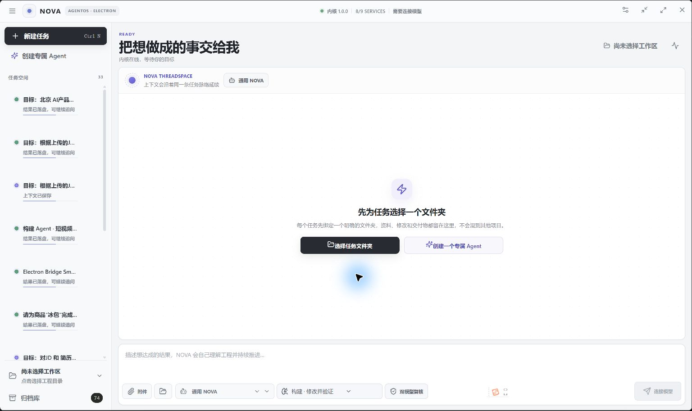
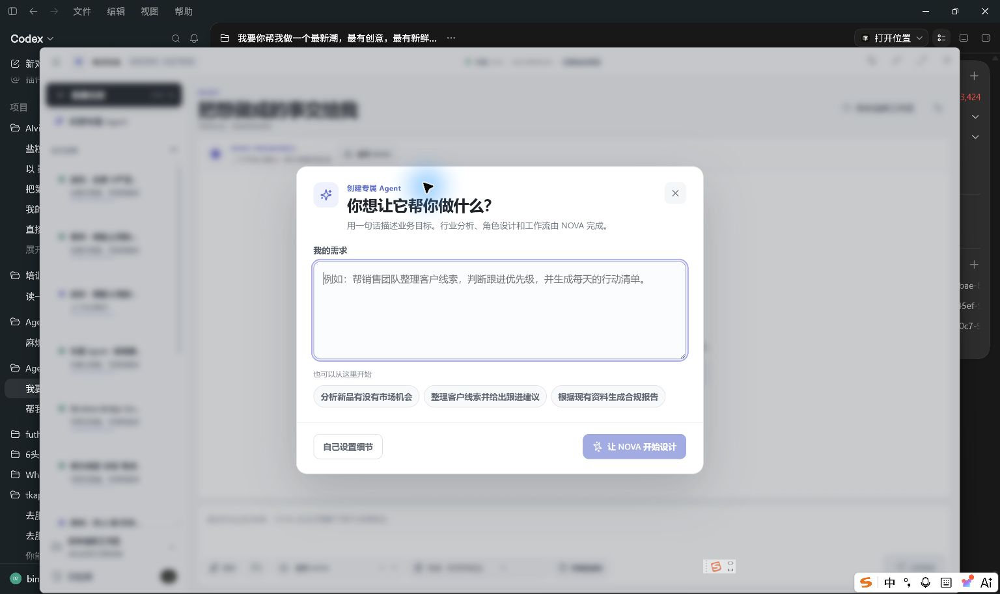
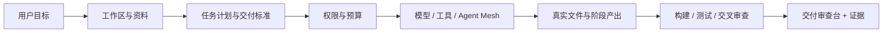
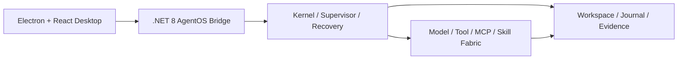

<p align="center">
  
</p>

<p align="center">
  <strong>简体中文</strong> · <a href="README_EN.md">English</a>
</p>

<p align="center">
  <strong>把想做成的事交给它。NOVA 负责理解、执行、落盘、验证和持续推进。</strong>
</p>

<p align="center">
  本地优先 · 结果导向 · 过程可见 · 证据交付 · 专业 Agent 可扩展
</p>

<p align="center">
  <a href="https://github.com/binzi1989/Nova/releases/latest"><strong>下载最新版本</strong></a>
  · <a href="#五分钟开始">五分钟开始</a>
  · <a href="#一句话创建专业-agent">创建 Agent</a>
  · <a href="AGENT-PACK-SDK.md">Agent Pack SDK</a>
</p>

<p align="center">
  <a href="https://github.com/binzi1989/Nova/actions/workflows/ci.yml"></a>
  <a href="https://github.com/binzi1989/Nova/releases"></a>
  
  
  
  
  
</p>

> [!IMPORTANT]
> 当前版本为 `1.1.0-preview.17`。Windows 主体验已进入真实任务验证；macOS、签名、公证、自动更新与规模化成功率基准仍在收紧。NOVA 不会把“本地测试通过”包装成 GA。

## 本次预览更新

- **运行中可以立即纠正方向**：用户补充要求或说“先停一下、改成这样”时，NOVA 会把消息当作控制指令，抢占当前可取消步骤，并在同一任务、同一工作区和同一上下文中自动续跑。
- **停止与恢复更可靠**：取消后的迟到模型响应不会覆盖新方向；任务快照、附件、已写文件和阶段成果继续保留。
- **Agent Pack 更健壮**：支持迁移早期工坊格式，保留完整角色、工作流、上传型输入和交付契约；新 Pack 继续由 NOVA 原生编译器体检与注册。
- **工作区与权限更清楚**：可写目录预检、持久授权、受控命令能力和失败后的原任务重试减少反复卡在“无写入权限”。
- **MCP 与网页执行更务实**：按任务需要发现能力、审阅后启用，并减少重复启动 MCP；网页执行会识别遮挡层、悬停菜单和登录分支。
- **更轻的跨平台界面**：Windows 与 macOS 共用 Electron 交互层，任务列表、执行过程、交付审查和 Agent 引导继续压缩噪声、突出下一步。

## NOVA 是什么

NOVA 是一款运行在 PC 上的 **AgentOS**。它不是给聊天窗口加几个工具，而是为 AI 增加一层完整的工作系统：

1. 先绑定一个真实工作区；
2. 把模糊目标整理成计划、边界与交付标准；
3. 调用模型、工具、MCP、Skills 和多个专业 Agent；
4. 在关键动作前处理权限和预算；
5. 将成果写成真实文件，并给出测试、审查或来源证据；
6. 允许用户在同一任务中继续追问、纠正、恢复和迭代。

一句话概括：**普通 AI 更擅长回答，NOVA 更关注把事情真正做完。**

## 真实界面

<p align="center">
  
</p>

<p align="center"><em>轻量化桌面工作台：工作区、任务脉络、输入、Agent 模式与执行状态集中在一个界面。</em></p>

<details>
  <summary><strong>查看：一句话创建专业 Agent</strong></summary>
  <br />
  <p align="center">
    
  </p>
</details>

## 软件功能与特点

| 能力 | 具体功能 | 对用户的价值 |
|---|---|---|
| **目标任务空间** | 工作区绑定、附件、多轮上下文、任务归档、暂停/恢复、中途纠正 | 不必每轮重新解释，文件和对话始终属于同一件事 |
| **可见执行计划** | 目标理解、任务拆解、阶段进度、下一步、参与 Agent、工具调用和阻塞原因 | 知道模型正在做什么，也知道卡在哪里 |
| **真实文件执行** | 读取、检索、修改、写入、构建、测试与受限命令执行 | 结果进入项目，而不是只停留在聊天文字里 |
| **多 Agent 协作** | 角色拆解、并行研究、独立审查、子 Agent 状态与产出展示 | 复杂任务可以分工，同时保留责任边界 |
| **交付审查台** | 窗内预览文件、主交付物排序、证据与验证结果、修改意见、版本化成果 | 用户能直接审查、反馈和继续加工 |
| **权限与预算** | 只读、工作区智能审核、桌面与工作区三档策略；高风险动作单独确认 | 减少重复弹窗，同时不牺牲关键安全边界 |
| **模型接入** | DeepSeek、OpenAI、Kimi、Ollama、OpenAI-compatible 自定义接口 | 云模型、本地模型与第三方兼容服务可自由选择 |
| **扩展坞** | MCP 导入/扫描、Skills、知识库、Hook 服务、SSH、云开发与组件商店 | 能力不是写死的，可按业务持续扩展 |
| **知识操作系统** | 本地索引、知识 Wiki、关系地图、来源追溯、映射确认与规则判断 | 将散落的任务、资料和交付物连接成企业/个人知识网络 |
| **智能上下文治理** | 任务胶囊、高信号上下文、Token 预算、上下文压缩与恢复检查点 | 少重复喂资料，降低 Token 浪费和长任务失忆 |
| **CLI 与服务接口** | NOVA CLI、Extension Gateway、Hook 事件、只读任务/交付订阅 | 可接网页、微服务、自动化平台和企业系统 |
| **插件式成长** | Evolution Lab 从重复工作中提出 Skill 候选，限额实验、人工审查、随时停用 | 允许个性化成长，但不开放或自改核心代码 |

## 从目标到证据



NOVA 的完成状态不是“模型回复结束”，而是：

- `PROVEN`：目标、文件与验证证据闭环；
- `PARTIAL`：完成了可证明的一部分，并明确剩余边界；
- `BLOCKED`：被真实权限、资料、预算或环境条件阻断。

## 一句话创建专业 Agent

用户不需要先理解角色、提示词、工作流或 JSON。只要说清楚业务目标，例如：

> 帮销售团队整理客户线索，判断跟进优先级，并生成每天的行动清单。

NOVA 会完成：

1. 识别行业、服务对象、交付物和风险边界；
2. 主动告诉用户应准备哪些核心资料；
3. 调用当前模型设计角色、工作流、输入输出契约和验证规则；
4. 在 Agent 工坊中保留草案供用户审阅；
5. 确认后创建正式构建任务，生成可运行 Agent Pack；
6. 用真实案例区分 `Runnable` 与 `Verified`。

Agent 工坊负责设计，任务空间负责编排和落地——两者职责明确，不再混成一条不可理解的流程。

## Agent Pack：把一个 NOVA 变成不同专业工作者

Agent Pack 是 NOVA 的垂直 Agent 标准。每个 Pack 可以声明：

- 专业角色与协作关系；
- 主工作流与阶段交付物；
- 用户需要准备的资料；
- 模型、MCP、Skills 和确定性工具依赖；
- 权限、预算、停止条件和风险边界；
- 输出格式、证据规则与首次使用引导；
- 基础测试与真实案例校准。

仓库内已包含跨境商品决策、人力与商务关系、猎头分析、短视频内容等实验性 Pack/案例。它们共享同一个 AgentOS，而不是复制出多套彼此割裂的客户端。

详见 [Agent Pack 操作指南](AGENT-PACK-OPERATING-GUIDE.md)、[Agent Pack SDK](AGENT-PACK-SDK.md) 与 [Agent Creation Standard](NOVA-AGENT-CREATION-STANDARD.md)。

## 扩展坞

扩展坞把所有外接能力放在一个清晰入口下：

- **模型**：DeepSeek、OpenAI、Kimi、Ollama、自定义兼容接口；
- **MCP**：扫描本机配置、粘贴 JSON/URL、审阅后启用、能力目录；
- **Skills**：安装、启用、说明、任务相关性推荐；
- **知识库**：本地索引、可追溯检索、Wiki、关系图谱和规则引擎；
- **服务接口**：本机只读 Hook Gateway，订阅任务与交付事件；
- **SSH / 云开发**：为远程工程与服务器任务预留受治理连接；
- **组件**：加载新的 Agent Pack、工具和工作台模块。

所有外部启用、写入和高风险访问都受权限策略治理。模型密钥不会提交到仓库。

## 技术架构



- Electron + React：Windows/macOS 共用桌面交互层；
- .NET 8 AgentOS Bridge/Core：任务、工具、知识、权限、恢复与证据内核；
- 本地工作区：文件、日志、检查点和交付物的事实来源；
- WPF 与早期 Mac 实现继续作为迁移和回归参考。

## 五分钟开始

### 直接体验

前往 [Releases](https://github.com/binzi1989/Nova/releases) 下载对应平台的 Preview 包：

1. 新建任务并选择一个真实文件夹；
2. 在扩展坞连接云模型或本地 Ollama；
3. 描述最终想看到的结果；
4. 审阅计划、Agent 分工和权限请求；
5. 在交付审查台检查文件、证据并提出修改意见。

### 本地构建

要求：Windows 10/11 x64 或 macOS 13+、.NET 8 SDK、Node.js 20+。

```powershell
git clone https://github.com/binzi1989/Nova.git
cd Nova/NovaDesktop.Electron
npm ci
npm run build
```

开发模式：

```powershell
cd NovaDesktop.Electron
npm run dev
```

主要验证：

```powershell
dotnet run --project NovaDesktop.SmokeTests/NovaDesktop.SmokeTests.csproj

cd NovaDesktop.Electron
npm run smoke:bridge
npm run smoke:cli
```

## 平台状态

| 平台 | 状态 | 说明 |
|---|---|---|
| Windows Electron x64 | 主体验 Preview | 当前主要体验与回归平台 |
| Windows WPF x64 | 成熟参考实现 | 用于功能迁移与回归对照 |
| macOS Electron arm64 / x64 | 同步 Preview | 共用 Electron UI 与核心；签名、公证仍待完成 |

### 距离 GA 仍需完成

- 真实任务成功率、终态准确率和恢复可靠性的持续基准；
- Windows 签名安装包与可信 HTTPS 更新源；
- macOS 签名、公证和跨平台回归；
- 更多真实行业案例与独立校准的 Verified Agent Pack；
- 无障碍、国际化和较低配置设备上的体验收紧。

## 安全边界

- 写入默认限制在用户选择的工作区；
- MCP、桌面控制、SSH、计划任务与额外模型成本具有独立审批边界；
- 多 Agent 子任务默认按最小权限运行；
- 日志、崩溃报告和证据账本会脱敏常见密钥模式；
- 达到预算上限时停在安全点，不伪装成已完成；
- Evolution Lab 默认关闭，只能产出可审阅、可停用的插件，不修改 NOVA 核心。

安全问题请阅读 [SECURITY.md](SECURITY.md)。不要在公开 Issue 中提交密钥、私人工作区内容或可直接利用的漏洞细节。

## 文档导航

| 文档 | 用途 |
|---|---|
| [Agent Pack 操作指南](AGENT-PACK-OPERATING-GUIDE.md) | 安装、启用和验证垂直 Agent |
| [Agent Pack SDK](AGENT-PACK-SDK.md) | 创建可复用行业 Pack |
| [Agent Creation Standard](NOVA-AGENT-CREATION-STANDARD.md) | 输入输出、引导、审批与验证标准 |
| [CLI](docs/CLI.md) | 命令行任务、状态与交付物操作 |
| [Extension Gateway](docs/EXTENSION-GATEWAY.md) | Hook 与本机微服务接口 |
| [Enterprise Knowledge Network](docs/ENTERPRISE-KNOWLEDGE-NETWORK.md) | 企业/个人知识网络 |
| [Smart Context Governor](docs/SMART-CONTEXT-GOVERNOR.md) | Token 与上下文治理 |
| [Changelog](CHANGELOG.md) | 版本变化记录 |

## 参与项目

欢迎提交可复现缺陷、真实任务反馈和边界清晰的改进。请先阅读 [CONTRIBUTING.md](CONTRIBUTING.md)。当前优先级：

1. 结果真实性与工程完整性；
2. 卡住任务、恢复失败与权限误判；
3. Windows/macOS 功能对等与可访问性；
4. 可复用、可校准、可验证的行业 Agent Pack。

## 许可

当前仓库尚未声明开源许可证。在项目所有者明确选择许可证前，代码默认保留全部权利。

---

<p align="center">
  <strong>NOVA AgentOS</strong><br />
  Result first. Evidence always. Continuity by design.
</p>
