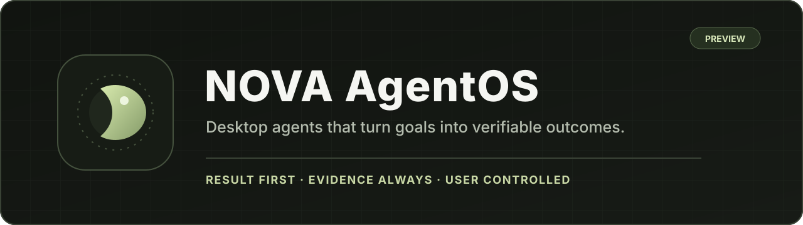
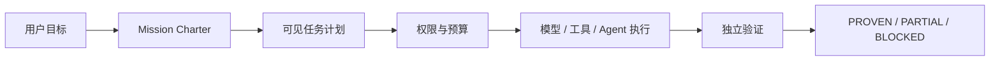
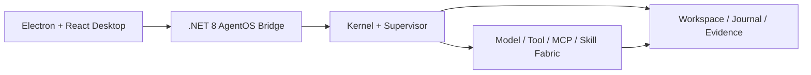

<p align="center"> <strong>简体中文</strong> · <a href="README_EN.md">English</a></p>\n\n<p align="center">
  
</p>

<p align="center">
  <strong>把目标变成可验证的成果，而不只是生成一段回答。</strong>
</p>

<p align="center">
  本地优先 · 证据优先 · 用户控制 · 可扩展桌面执行
</p>

<p align="center">
  <a href="https://github.com/binzi1989/Nova/actions/workflows/ci.yml"></a>
  <a href="https://github.com/binzi1989/Nova/releases"></a>
  
  
  
  
</p>

> [!IMPORTANT]
> 当前稳定基线为 `1.1.0`。安装包尚未签名，自动更新默认关闭；最新可下载版本请以 [GitHub Releases](https://github.com/binzi1989/Nova/releases) 为准。

## NOVA 是什么

NOVA 是一款面向 PC 的桌面 AgentOS。它把用户给出的目标编排为任务计划，在明确的工作区、权限和预算边界内调用模型、工具与子 Agent，最终用真实文件、构建测试和证据账本判断任务是否完成。

它不是“把聊天窗口做得更复杂”，而是在补齐 AI 从回答到交付之间缺失的执行层。

| 普通 AI 对话 | NOVA AgentOS |
|---|---|
| 输出文字或代码片段 | 在授权工作区中真实创建、修改并验证文件 |
| 对执行过程缺少统一真值 | 计划、权限、预算、进度与交付来自同一任务状态 |
| 模型声称“已经完成” | 通过 Proof-of-Done 给出 `PROVEN` / `PARTIAL` / `BLOCKED` |
| 能力被单一模型或封闭工具链限制 | 支持多模型、MCP、Skills、SSH 与自定义端点 |
| 中断后容易丢失工作 | 保存检查点、上下文、证据与可恢复状态 |

## 核心能力

- **真实执行**：受控文件读写、Patch、搜索、构建、测试和有限命令执行。
- **多轮任务脉络**：Threadspace 保存意图、附件、关键上下文、任务计划与历史成果。
- **多模型运行时**：支持 OpenAI、DeepSeek、Kimi、Ollama 及 OpenAI-compatible 自定义端点。
- **Agent 协作**：Agent Mesh、并行研究、隔离 Worktree 候选方案与独立 Council 审查。
- **权限与预算治理**：低风险操作可按轮合并授权，高风险操作逐次确认，预算在安全点收口。
- **可信交付**：交付物、验证结果、证据来源和未完成边界在同一结果页呈现。
- **恢复能力**：任务暂停、取消、归档、崩溃恢复和副作用幂等。
- **扩展坞**：MCP、Skills、SSH、云开发、自定义模型与组件接口统一治理。

## 一次任务如何完成



NOVA 不把“过程很热闹”当成成功。需要修改工程却没有真实落盘，或没有足够验证证据时，任务不会被标记为完整交付。

## 技术架构



Electron 是 Windows 与 macOS 共用的主要交互壳，复用跨平台 `.NET 8` AgentOS Bridge/Core。仓库保留 WPF Windows 实现与早期 Avalonia Mac Preview，作为迁移和回归参考。

## 快速开始

### 环境要求

- Windows 10/11 x64，或 macOS 13+
- .NET 8 SDK
- Node.js 20+
- PowerShell 7 或 Windows PowerShell 5.1

### 本地构建

```powershell
git clone https://github.com/binzi1989/Nova.git
cd Nova/NovaDesktop.Electron
npm ci
npm run build
```

### 启动开发环境

```powershell
cd NovaDesktop.Electron
npm run dev
```

### 验证 AgentOS 与 Bridge

```powershell
dotnet run --project NovaDesktop.SmokeTests/NovaDesktop.SmokeTests.csproj

cd NovaDesktop.Electron
npm run smoke:bridge
```

macOS 构建说明见 [Mac 路线图](NOVA-MAC-ROADMAP.md)。

## 模型与密钥

NOVA 不在仓库中保存模型密钥。桌面端可仅在当前进程内存中使用密钥，也支持 Windows Credential Manager 和以下环境变量：

- `OPENAI_API_KEY`
- `DEEPSEEK_API_KEY`
- `MOONSHOT_API_KEY`

Ollama 与兼容端点可以配置 Base URL。本地和局域网地址允许 HTTP；远程端点默认要求 HTTPS。

## 平台状态

| 平台 | 状态 | 说明 |
|---|---|---|
| Windows Electron x64 | 主体验 Preview | 连接 .NET 8 AgentOS Bridge/Core |
| Windows WPF x64 | 成熟参考实现 | 保留用于功能迁移与回归验证 |
| macOS Electron arm64 / x64 | 同步体验 Preview | 共用 Electron UI 与核心；尚未签名、公证 |

## 安全与可信边界

- 所有写入必须位于用户选择的工作区内；
- MCP 启动、桌面控制、计划任务和额外模型成本具有独立审批边界；
- Agent Mesh 子 Agent 默认只读，在隔离 Worktree 中产出候选 Patch；
- 日志、崩溃报告和证据账本对常见 API Key 与 Bearer Token 模式脱敏；
- 达到预算上限时在安全点停止，不把预算耗尽伪装成完成。

安全问题请遵循 [Security Policy](SECURITY.md)，不要在公开 Issue 中提交密钥、私有工作区内容或可直接利用的漏洞细节。

## 文档导航

| 文档 | 用途 |
|---|---|
| [1.0 范围冻结](NOVA-1.0-SCOPE-FREEZE.md) | 正式发布边界 |
| [1.0 GA Readiness](NOVA-1.0-GA-READINESS.md) | 发布阻断项 |
| [竞争差距分析](NOVA-1.0-COMPETITIVE-GAP.md) | 与成熟 Agent 产品的客观差距 |
| [Changelog](CHANGELOG.md) | 版本变化记录 |

## 参与项目

欢迎提交可复现缺陷、体验反馈和边界清晰的改进建议。请先阅读 [CONTRIBUTING.md](CONTRIBUTING.md)。当前阶段优先处理：

1. 结果真实性与工程完整性；
2. 任务卡住、恢复失败和预算误判；
3. Windows / macOS 功能对等与可访问性；
4. MCP、Skills 与自定义模型扩展的稳定性。

## 许可证

当前仓库尚未声明开源许可证。在项目所有者明确选择许可证之前，代码默认保留全部权利。

---

<p align="center">
  <strong>NOVA AgentOS</strong><br />
  Make the work observable. Make the result provable.
</p>
