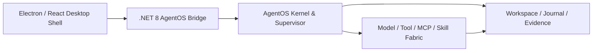

# NOVA AgentOS


NOVA 是一个本地优先、证据优先、由用户控制的桌面 AgentOS。它不只生成回答，而是把目标转换为可执行任务，在明确的工作区、权限和预算边界内调用模型与工具，并用真实文件、测试结果和可追溯证据判断任务是否完成。

> 当前版本：`1.0.0`
> 当前状态：首个 1.0 桌面基线。安装包未签名，自动更新默认关闭。

## 为什么需要 NOVA

传统 AI 助手经常停留在“给出代码或建议”，但没有解决以下问题：

- 是否真的创建或修改了文件；
- 是否运行了构建与测试；
- 多 Agent 是否越权或重复消耗预算；
- 应用崩溃后能否从安全点继续；
- 工作区变化后，旧证据是否仍然有效；
- 用户是否能看见任务计划、权限、状态和交付物。

NOVA 把这些问题统一到一条执行链：

```text
目标
  → Mission Charter
  → 任务图
  → 权限与预算治理
  → 模型 / 工具 / Agent 执行
  → 独立验证
  → PROVEN / PARTIAL / BLOCKED
```

## 当前能力

- 全屏多轮 Threadspace，支持 Markdown、代码块、表格、附件与交互选项；
- Ask、Plan、Build、Autopilot、Goal 五种任务模式；
- OpenAI、DeepSeek、Kimi、Ollama 与 OpenAI-compatible 自定义端点；
- 可选双模型复核：主模型执行，另一不同来源模型以全新只读上下文独立审查；
- 受控文件读写、搜索、Patch、构建、测试和有限命令执行；
- MCP stdio / Streamable HTTP、Skills、SSH 与云开发扩展入口；
- Agent Mesh、并行研究、Worktree Tournament 与独立 Council 审查；
- Mission Charter、Proof-of-Done、证据账本和状态真值；
- Electron 可信交付门：需要改工程却没有真实写入或验证时标记 PARTIAL，不冒充完成；
- 持久任务、归档、暂停、取消、安全恢复与副作用幂等；
- 插件式自进化实验：默认关闭、预算受限、不暴露或修改核心源码。

## 架构



当前 Electron 是 Windows 与 macOS 共用的主要交互壳，复用同一套跨平台 `.NET 8` AgentOS Bridge/Core。仓库仍保留成熟的 WPF Windows 实现和早期 Avalonia Mac Preview，作为迁移与回归参考。

## 快速开始

### 环境

- Windows 10/11 x64，或 macOS 13+
- .NET 8 SDK
- Node.js 20+
- PowerShell 7 或 Windows PowerShell 5.1

### 构建 Electron 桌面壳

```powershell
cd NovaDesktop.Electron
npm ci
npm run build
```

在 macOS 上构建 Apple Silicon 与 Intel 发布包：

```bash
cd NovaDesktop.Electron
npm ci
npm run package:mac
```

### 启动开发环境

```powershell
cd NovaDesktop.Electron
npm run dev
```

### 运行 AgentOS 自动烟雾测试

```powershell
dotnet run --project NovaDesktop.SmokeTests/NovaDesktop.SmokeTests.csproj
```

### 验证 Electron 与 .NET Bridge

```powershell
cd NovaDesktop.Electron
npm run smoke:bridge
```

## 模型与密钥

NOVA 不在仓库中保存模型密钥。桌面端支持仅在当前进程内存中使用密钥，也可由 Windows Credential Manager 或以下环境变量提供：

- `OPENAI_API_KEY`
- `DEEPSEEK_API_KEY`
- `MOONSHOT_API_KEY`

Ollama 与自定义兼容端点可配置 Base URL。本地和局域网地址允许 HTTP；远程端点默认要求 HTTPS。

## 安全边界

- 所有写入必须位于用户选择的工作区内；
- 低风险同类操作可以按轮次合并授权，高风险操作必须逐次确认；
- MCP 启动、桌面控制、计划任务和额外模型成本具有独立审批边界；
- Agent Mesh 子 Agent 默认只读，并在隔离 Worktree 中产生候选 Patch；
- 日志、崩溃报告和证据账本会对常见 API Key 与 Bearer Token 模式脱敏；
- 达到预算上限时，任务在下一个安全点停止，不把预算耗尽伪装成完成。

更详细的安全报告方式见 [SECURITY.md](SECURITY.md)。

## 平台状态

| 平台 | 状态 | 说明 |
|---|---|---|
| Windows Electron x64 | 主体验 Preview | 连接 .NET 8 AgentOS Bridge/Core |
| Windows WPF x64 | 成熟参考实现 | 功能较完整，保留用于服务与迁移验证 |
| macOS Electron arm64 / x64 | 同步体验 Preview | 与 Windows 共用 Electron UI 和 AgentOS Bridge/Core；未签名、未公证，Windows 专属桌面控制能力除外 |

## 项目结构

| 目录 | 作用 |
|---|---|
| `NovaDesktop.Electron` | Electron / React 桌面壳 |
| `Nova.AgentOS.Bridge` | Electron 与 .NET AgentOS IPC 桥 |
| `NovaDesktop` | WPF 壳与主要服务实现 |
| `Nova.AgentOS` | Kernel、Supervisor、任务图和治理模型 |
| `Nova.Core` | 跨平台基础模型与 Provider 协议 |
| `NovaDesktop.Mac` | 早期 Avalonia Mac Preview，保留用于迁移参考 |
| `NovaDesktop.SmokeTests` | AgentOS 自动烟雾测试 |
| `ga` / `tools` | GA 基准、验证和发布工具 |

## 1.0 发布边界

1.0 不以功能数量为准，而以“每次显示完成时，都能找到真实文件、验证结果和可追溯证据”为准。当前剩余主要阻断项：

- 30 项固定任务各运行 3 次的真实端到端基准；
- Truthful UX、键盘可访问性、最大化与高 DPI 人工验收；
- Windows 主程序与安装器 Authenticode 签名；
- 真实 HTTPS 更新源、SHA-256 和签名发布清单；
- Electron / WPF 正式主线与 Mac 功能对等范围冻结。

参见：

- [NOVA 1.0 范围冻结](NOVA-1.0-SCOPE-FREEZE.md)
- [NOVA 1.0 GA Readiness](NOVA-1.0-GA-READINESS.md)
- [NOVA 1.0 竞争差距](NOVA-1.0-COMPETITIVE-GAP.md)
- [Mac 路线图](NOVA-MAC-ROADMAP.md)

## 发布包

二进制安装包不会提交到 Git 历史。每个可下载版本通过 GitHub Releases 发布，并附带 SHA-256、平台、签名状态和已知限制。

## 许可证

当前仓库尚未声明开源许可证。在项目所有者明确选择许可证之前，代码默认保留全部权利。
