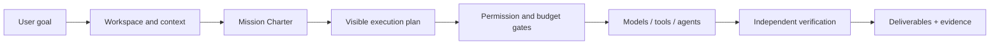
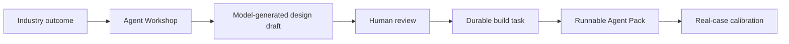
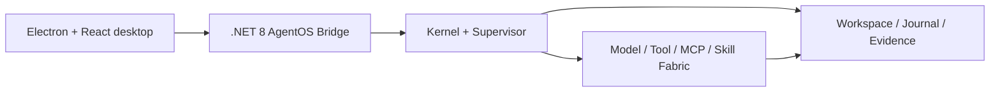

<p align="center">
  
</p>

<p align="center">
  <a href="README.md">简体中文</a> · <strong>English</strong>
</p>

<p align="center">
  <strong>Turn goals into verifiable deliverables—not just another answer.</strong>
</p>

<p align="center">
  Local-first · Evidence-first · User-controlled · Extensible by design
</p>

<p align="center">
  <a href="https://github.com/binzi1989/Nova/releases/latest"><strong>Download the latest release</strong></a>
  ·
  <a href="#quick-start">Quick start</a>
  ·
  <a href="#agent-packs-industry-agents-without-another-desktop-app">Agent Packs</a>
  ·
  <a href="AGENT-PACK-SDK.md">Build an Agent Pack</a>
</p>

<p align="center">
  <a href="https://github.com/binzi1989/Nova/actions/workflows/ci.yml"></a>
  <a href="https://github.com/binzi1989/Nova/releases"></a>
  
  
  
  
  
</p>

> [!IMPORTANT]
> The latest preview is `1.1.0-preview.15`. Installers are not yet signed and automatic updates remain disabled by default. Use [GitHub Releases](https://github.com/binzi1989/Nova/releases) as the source of public builds. NOVA has a complete product foundation, but it is still being validated on real tasks and across platforms. Passing local tests is not presented as GA readiness.

## This preview

- **A more reliable Agent Workshop:** every design agent's stage output is persisted. NOVA repairs incomplete structures locally first and makes at most one bounded model-repair request when the response cannot be parsed, avoiding another full-token run.
- **Real work survives imperfect formatting:** recoverable drafts remain available for human review instead of discarding an entire orchestration because the coordinator returned malformed JSON.
- **Practical document input:** Word, PDF, and common text attachments share one extraction path, with explicit diagnostics when content cannot be read safely.
- **More complete Agent Packs:** unique generated IDs, safe removal, industry templates, onboarding, capability requirements, and durable build tasks follow the Agent Creation Standard.
- **Verified Windows build:** the Electron client, AgentOS Bridge, Workshop recovery smoke test, and production build all pass.

## What is NOVA?

NOVA is a native desktop AgentOS for goal-driven work. It turns an outcome into a visible plan, operates inside explicit workspace, permission, and budget boundaries, coordinates models, tools, and sub-agents, and decides whether the job is complete using real files and reproducible evidence.

It is the execution layer between **AI that can answer** and **AI that can deliver**.

| Goal-driven | Observable | Verifiable |
|---|---|---|
| Describe the outcome you want; NOVA identifies the work and constraints | Plans, agents, tools, approvals, budgets, and progress share one durable task state | Deliverables must exist on disk and include build, test, or reviewable evidence |
| Continue the same task across multiple turns | Pause, correct, resume, recover, and inspect without losing the thread | Terminal states are explicit: `PROVEN`, `PARTIAL`, or `BLOCKED` |

## From intent to proof



NOVA does not treat a long model response as completion. If a task requires a file change and no file was written, or requires verification and no evidence exists, the task cannot be marked as a complete delivery.

## Why NOVA exists

Most AI products optimize the conversation. NOVA optimizes the work lifecycle around it.

| Capability | NOVA's approach |
|---|---|
| **Real execution** | Read, search, patch, write, build, test, and run bounded commands inside a user-approved workspace |
| **Continuous tasks** | Threadspace retains intent, attachments, key context, plans, checkpoints, and previous deliverables |
| **Multi-agent collaboration** | Agent Mesh assigns roles and work packages, exposes each agent's status and output, and supports independent review |
| **Permission and budget governance** | Low-risk actions can be approved for a bounded run; high-risk actions remain individually gated |
| **Proof-of-Done delivery** | Files, changes, verification results, evidence sources, and unfinished boundaries appear in one result surface |
| **Recoverable execution** | Pause, cancel, archive, resume, crash recovery, idempotent side effects, and task-ownership repair |

## Product surfaces

| Surface | Responsibility |
|---|---|
| **Threadspace** | Keeps conversation, attachments, task state, corrections, and deliverables on one durable thread |
| **AgentOS Runtime** | Coordinates model calls, tools, approvals, budgets, leases, checkpoints, and recovery |
| **Action Pulse** | Shows the plan, agent assignments, progress, tool output, and blockers as work happens |
| **Delivery Workspace** | Reviews files, evidence, verification outcomes, and versioned artifacts without leaving NOVA |
| **Extension Dock** | Connects models, MCP servers, Skills, knowledge sources, SSH, cloud environments, and components |
| **Evolution Lab** | Distills repeated work patterns into reviewable, disableable plugins under an explicit switch and token budget |

## Agent Packs: industry agents without another desktop app

Agent Packs are NOVA's standard for vertical capabilities. A Pack can combine specialist roles, workflows, deterministic tools, evidence rules, knowledge baselines, first-run guidance, and delivery templates—without forking the desktop client.



### Agent Workshop

- Starts with the industry, service audience, desired deliverable, and operating constraints;
- Lets the model propose the information users should prepare instead of presenting a blank configuration template;
- Designs roles, responsibilities, workflow steps, input/output contracts, and risk boundaries with a real model;
- Keeps the design draft inside the Workshop for review;
- Creates a formal Taskspace build only after the user approves the design;
- Generates unique Agent IDs and supports safe removal of unwanted Packs;
- Separates `Runnable` structural validation from `Verified` real-case calibration.

### First vertical reference: cross-border product decision agent

The included cross-border commerce Pack evaluates more than a financial spreadsheet. It combines product evidence, market demand, competitive intensity, content potential, compliance risk, and execution difficulty:

- Turns sparse images, prices, and market clues into a Product Passport;
- Identifies audiences, demand signals, content angles, competitive pressure, and information gaps;
- Calculates auditable landed cost, contribution margin, break-even ad cost, and ROAS;
- Records source date, confidence, conflicts, and freshness instead of presenting assumptions as facts;
- Recommends **enter**, **test**, **collect more evidence**, or **stop**, with concrete next actions.

See the [Agent Pack operating guide](AGENT-PACK-OPERATING-GUIDE.md), [Agent Pack SDK](AGENT-PACK-SDK.md), and [NOVA Agent Creation Standard](NOVA-AGENT-CREATION-STANDARD.md).

## Extension Dock

NOVA centralizes external capabilities behind one governed surface:

- **Models:** OpenAI, DeepSeek, Kimi, Ollama, and custom OpenAI-compatible endpoints;
- **MCP:** local discovery, manual import, remote connections, marketplace candidates, and pre-enable review;
- **Skills:** install, enable, inspect, recommend, and remove task capabilities;
- **Knowledge:** local indexing, cited retrieval, cognitive graph, and workspace-specific sources;
- **Remote environments:** SSH and cloud development profiles;
- **Components:** standard extension points for new Agent Packs, tools, and workbench modules.

Model credentials are never committed to this repository. The desktop client can keep keys in process memory and also supports Windows Credential Manager and environment-variable workflows.

## Evolution without exposing the core

Evolution Lab is intentionally plugin-only:

1. It detects repeated goals and operating patterns from local task metadata;
2. A model may improve a declarative `SKILL.md` inside a tightly bounded sandbox;
3. Static validation rejects executable code, permissions, dependencies, network clients, credentials, or core modification;
4. The user reviews the exact diff before installing the result as a disableable Skill.

Evolution is off by default. Scheduled discovery, per-experiment tokens, monthly tokens, weekly experiments, and model rounds all have explicit controls.

## Architecture



Electron is the shared Windows and macOS interaction shell. It reuses the cross-platform `.NET 8` AgentOS Bridge and Core. The repository also retains the earlier WPF Windows implementation and Avalonia Mac Preview as migration and regression references.

## Quick start

### Try a preview build

Download the package for your platform from [Releases](https://github.com/binzi1989/Nova/releases). On first launch:

1. Select a real project workspace;
2. Connect a hosted model or local Ollama endpoint;
3. Describe the result you want to see;
4. Review the execution plan and permission requests;
5. Inspect the generated files and evidence in Delivery Workspace.

### Build locally

Requirements: Windows 10/11 x64 or macOS 13+, .NET 8 SDK, and Node.js 20+.

```powershell
git clone https://github.com/binzi1989/Nova.git
cd Nova/NovaDesktop.Electron
npm ci
npm run build
```

Run the desktop development environment:

```powershell
cd NovaDesktop.Electron
npm run dev
```

Validate AgentOS and the Electron bridge:

```powershell
dotnet run --project NovaDesktop.SmokeTests/NovaDesktop.SmokeTests.csproj

cd NovaDesktop.Electron
npm run smoke:bridge
```

See the [macOS roadmap](NOVA-MAC-ROADMAP.md) for packaging notes.

## Platform status

| Platform | Status | Notes |
|---|---|---|
| Windows Electron x64 | Primary Preview experience | Uses the .NET 8 AgentOS Bridge/Core |
| Windows WPF x64 | Mature reference implementation | Retained for migration and regression testing |
| macOS Electron arm64 / x64 | Synchronized Preview | Shares the Electron UI and core; signing and notarization are pending |

### Remaining GA gates

- Repeatable success-rate and terminal-state benchmarks on real tasks;
- Manual acceptance testing across the six primary product surfaces;
- Signed Windows installer and trusted HTTPS update channel;
- macOS signing, notarization, and cross-platform regression coverage;
- More real industry cases and independently calibrated Verified Agent Packs.

## Security boundaries

- Writes must stay inside the user-selected workspace;
- MCP execution, desktop control, schedules, and additional model cost have separate approval boundaries;
- Agent Mesh workers are read-only by default and can produce candidate changes inside isolated worktrees;
- Logs, crash reports, and evidence ledgers redact common API-key and Bearer-token patterns;
- Budget exhaustion stops at a safe boundary and is never presented as completion;
- Evolution Lab is disabled by default and can only produce reviewable plugins—it cannot expose or patch NOVA core.

Please follow the [Security Policy](SECURITY.md). Never submit secrets, private workspace contents, or directly exploitable vulnerability details in a public issue.

## Documentation

| Document | Purpose |
|---|---|
| [Agent Pack operating guide](AGENT-PACK-OPERATING-GUIDE.md) | Install, enable, and validate vertical agents |
| [Agent Pack SDK](AGENT-PACK-SDK.md) | Build reusable industry Packs |
| [Agent Creation Standard](NOVA-AGENT-CREATION-STANDARD.md) | Input, output, onboarding, approval, and verification rules |
| [Cross-border commerce agent market report](CROSS-BORDER-COMMERCE-AGENT-MARKET-REPORT-2026.md) | Industry pain points, competitors, and differentiation |
| [1.0 scope freeze](NOVA-1.0-SCOPE-FREEZE.md) | Release boundaries |
| [1.0 GA readiness](NOVA-1.0-GA-READINESS.md) | Current release blockers |
| [Competitive gap analysis](NOVA-1.0-COMPETITIVE-GAP.md) | An objective gap review against mature agent products |
| [Changelog](CHANGELOG.md) | Version history |

## Contributing

Reproducible bug reports, experience feedback, and bounded improvements are welcome. Please read [CONTRIBUTING.md](CONTRIBUTING.md) first. Current priorities are:

1. Outcome integrity and engineering completeness;
2. Stalled tasks, failed recovery, and incorrect budget boundaries;
3. Windows/macOS parity and accessibility;
4. Reusable and verifiable industry Agent Packs.

## License

This repository does not currently declare an open-source license. Until the project owner explicitly selects one, all rights are reserved by default.

---

<p align="center">
  <strong>NOVA AgentOS</strong><br />
  Result first. Evidence always. Continuity by design.
</p>
